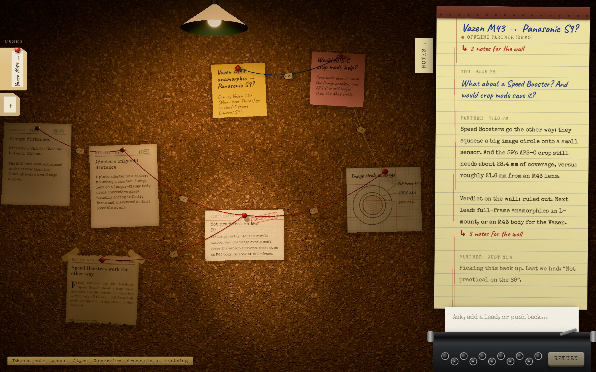
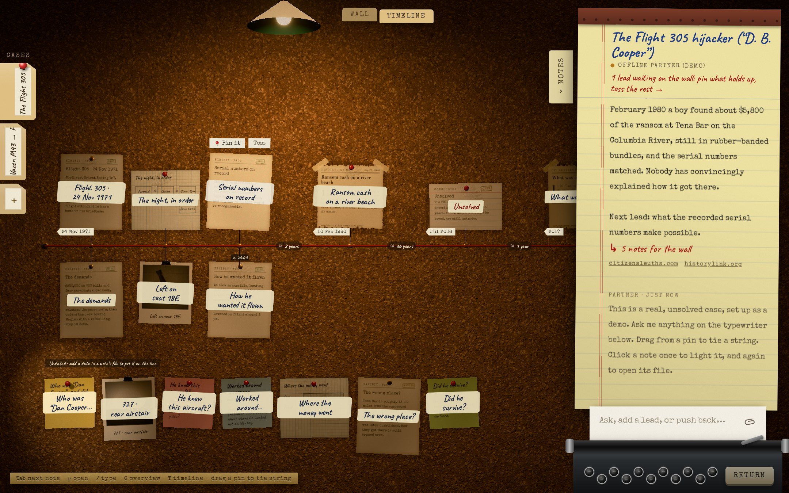
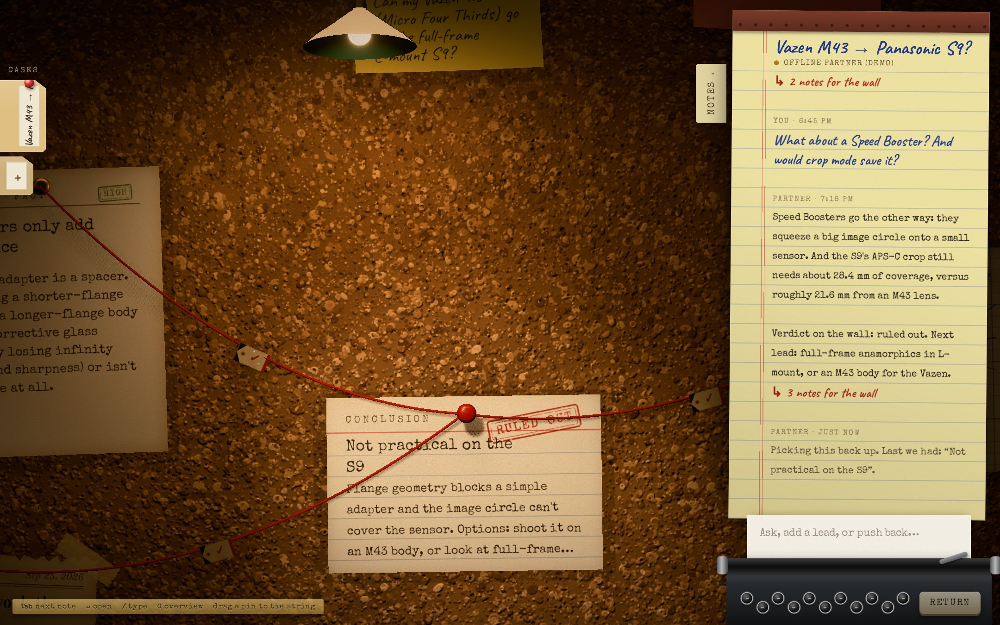

# Detective Wall

Every question becomes a case. You talk it through with Claude, and the evidence ends up pinned to a cork wall in a lamp-lit attic: sticky notes, typed facts, newspaper clippings, graph-paper sketches, and red string between them.



- **Claude is your partner.** It streams its reply onto a legal pad, searches the web when facts are checkable, and proposes evidence for the wall.
- **You hold the pen.** Everything Claude suggests arrives loose, with a pencil "?". Nothing sticks until you pin it.
- **Every note remembers where it came from.** Open a note to see the conversation or URL behind it, and every string tied to it.
- **Light means attention.** A spotlight follows your focus, and what nobody has looked at yet stays in the dark.





The demo opens on a real, unsolved case: the 1971 Flight 305 hijacking ("D. B. Cooper"), set up with the documented evidence, the case's real photos (the aircraft, the FBI composite sketch, the recovered ransom bills, loaded from Wikimedia Commons with their credits), the open questions and one lead waiting to be pinned. Without an API key the offline partner walks through three fact-checked leads for it. The full product spec is in [SPEC.md](SPEC.md).

## Run it

```bash
npm install
cp .env.example .env      # add your ANTHROPIC_API_KEY
npm run dev               # http://localhost:5173
```

Without a key the app still runs, using a clearly labelled **offline partner** that structures the case but can't check facts.

**On your Claude subscription instead of an API key:** if Claude Code is installed and logged in on your machine (`claude` then `/login`), leave `ANTHROPIC_API_KEY` empty and the partner runs each turn through `claude -p` with web search and fetch, billed to your subscription. The notepad reads "Claude · your subscription". This uses whoever is logged in to Claude Code on the machine running the server, so it's for your own local use, not for a deployed site.

Production:

```bash
npm run build
npm start                 # serves dist/ and the API on $PORT (default 8787)
```

| Env var | Default | |
|---|---|---|
| `ANTHROPIC_API_KEY` | none | Enables Claude. Without it, the offline partner answers. |
| `DW_MODEL` | `claude-opus-5` | The model that works the case |
| `DW_WEB_SEARCH` | `on` | Set to `off` to stop Claude searching the web |
| `PORT` | `8787` | Port for `npm start` |
| `DW_PARTNER` | auto | `api`, `claude-cli` or `offline`. Auto: the API with a key, else the CLI if installed, else offline. |
| `DW_CLI_MODEL` | `claude-opus-5-5` | Model for CLI turns |
| `DW_CLI_EFFORT` | `high` | Effort for CLI turns (`low` … `max`) |
| `DW_CLI_PATH` | `claude` | Path to the Claude Code binary |

## Using the wall

| | |
|---|---|
| Ask | Type on the typewriter and press Enter (`/` jumps there) |
| Accept or reject | Press and hold a loose note to pin it, or drag any note into the wastebasket that rises while you carry it. **Pin it** / **Toss**, ✓ / ✕ on a dashed string, `P` / `X`, and "pin all" under each reply work too. |
| Watch it work | While the partner researches, each find goes up on the wall as it's made, and its searches and pages are pencilled into the notepad margin. |
| Tie a string | Drag from a note's pin to another note, then pick *supports*, *causes*, *contradicts* or *references* (keys `1`–`4`) |
| Open a note | Click it once to focus it, click again to open its file (`Enter` works too). Edits save as you type. |
| Move around | Drag empty cork to pan. Scroll or pinch to zoom. `0` shows the whole wall. `Tab` moves through the notes. |
| Undo | `⌘Z` / `Ctrl+Z` undoes the last change to the wall (take down, cut, tie, pin, move, edit, the partner's proposals); `⇧⌘Z` / `Ctrl+Y` redoes it. Anything taken down leaves a slip with an Undo button. |
| Overview | Zoom out and each note gets a masking-tape label with its title, so the whole case stays readable from a distance. |
| Timeline | The **Timeline** tab (or `T`) hangs every dated note in order from a cord across the wall. Long silences are marked ("≈ 8 years") and undated notes wait in a tray below. Give a note a date in its file ("24 Nov 1971", "1971-11-24 20:13", "c. 1972") and it takes its place. **Wall** puts everything back where it was. |
| Photos | Drop photos onto the wall, paste one, or use the paperclip on the typewriter to send photos with your next message so Claude can look at them. Each photo's file has a large print and "Ask the partner about this photo". Photos are downscaled and stored in this browser's IndexedDB. |
| Cases | The five most recent cases are manila folders on the left; hover one to read it, click to open, "+" starts a new case. The steel pull below them (or `C`) opens the filing cabinet with every case: search titles and the evidence inside them, sort, open or shred. |

Everything is saved in your browser's localStorage.

## How it's built

The wall is a real 3D scene. The lamplight, the focus spotlight, soft shadows, cork relief, curled paper and thread are all rendered by WebGL through React Three Fiber, not painted on with CSS. Everything you read at length or type into (the notepad, the dossier, the folders, the on-wall buttons) is ordinary DOM, so it stays sharp and accessible.

```
src/
  App.tsx               room layout, global keys (the 3D wall is lazy-loaded)
  store.ts              cases, notes, strings, messages (Zustand, persisted)
  components/
    Wall.tsx            camera (pan / zoom / framing), grabbing, string tying, DOM overlays
    Notepad.tsx         legal-pad transcript and typewriter
    CaseTray.tsx        case folders
    Dossier.tsx         note detail folder and string-type picker
  scene/
    Room.tsx            camera rig, tungsten light + focus spotlight, cork, dust, post-processing
    NoteMesh.tsx        curled paper sheets, pins, tape, contact shadows, lift-and-settle motion
    Strings3D.tsx       thread tubes along a sagging curve, and relation tags
    Timeline3D.tsx      the timeline cord, tacks and threads
    paint.ts            typesets each sheet onto a canvas: typewriter jitter, handwriting, newsprint, stamps, sketches
    objects.ts          sheet curl geometry, lathe-turned pins, binder clip, tape
    textures.ts         procedural cork (albedo / normal / roughness), paper fibre, string twist
  ai/partner.ts         calls /api/investigate and reads the SSE stream
  ai/offline.ts         scripted partner for when there's no key
  lib/contract.ts       update_wall tool schema and validator (shared with the server)
  lib/timeline.ts       timeline layout: date groups, gaps, undated tray
  lib/when.ts           partial dates ("1971", "1971-11-24T20:13"): parse, sort, label
  lib/images.ts         photo import (downscale), IndexedDB storage, base64 for Claude
  lib/commons.ts        real photos from Wikimedia Commons: URL + author/licence from file metadata
server/
  api.ts                Claude turn: streaming, web search, update_wall tool
  index.ts              production static and API server
```

- **The light is physical.** A tungsten lamp hanging just out of shot falls off with distance and rakes across the cork. A cooler spotlight glides to whatever you're focused on. Both cast soft shadows: pins, curled corners and string all throw them. A cool, low fill keeps the shadows blue-grey against the warm light. Dust motes show only inside the light beams.
- **Every sheet is made, not styled.** Each sheet is a curved mesh: stickies lift at the free end, typed sheets curl at a corner, newsprint cockles. Its face is typeset onto a 3× canvas with seeded imperfections, so the same note always looks the same.
- **The camera looks straight at the wall.** Screen↔wall mapping is exact, so panning, zooming, dragging and the DOM overlays line up pixel for pixel.
- **Claude's wall edits go through one strict tool, `update_wall`.** The server validates the tool input, and the browser validates it again. A `web` note has to cite a URL that the search actually returned.
- **Textures are procedural and fonts are self-hosted**, so there are no asset downloads and no third-party requests.
- **Lighter render on small screens.** Phones and small screens skip ambient occlusion and use smaller shadow maps.

Debug switches for tuning the look: `?fx=0` turns off post-processing, `?ao=0` turns off ambient occlusion, `?fill=0` turns off the fill light.

```bash
npm test           # contract + geometry unit tests
npm run typecheck
```
