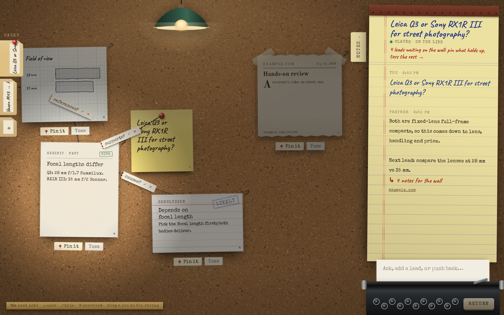

# Detective Wall

Every question becomes a case. You talk it through with Claude, and the evidence ends up pinned to a cork wall in a lamp-lit attic: sticky notes, typed facts, newspaper clippings, graph-paper sketches, and red string between them.


- **Claude is your partner.** It streams its reply onto a legal pad, searches the web when facts are checkable, and proposes evidence for the wall.
- **You hold the pen.** Everything Claude suggests arrives loose, with a pencil "?". Nothing sticks until you pin it.
- **Every note remembers where it came from.** Open a note to see the conversation or URL behind it, and every string tied to it.
- **Light means attention.** A spotlight follows your focus, and what nobody has looked at yet stays in the dark.



The full product spec is in [SPEC.md](SPEC.md).

## Run it

```bash
npm install
cp .env.example .env      # add your ANTHROPIC_API_KEY
npm run dev               # http://localhost:5173
```

Without a key the app still runs, using a clearly labelled **offline partner** that structures the case but can't check facts.

Production:

```bash
npm run build
npm start                 # serves dist/ and the API on $PORT (default 8787)
```

| Env var | Default | |
|---|---|---|
| `ANTHROPIC_API_KEY` | none | Enables Claude. Without it, the offline partner answers. |
| `DW_MODEL` | `claude-opus-5` | The model that works the case |
| `DW_WEB_SEARCH` | `on` | Set to `off` to stop Claude searching the web |
| `PORT` | `8787` | Port for `npm start` |

## Using the wall

| | |
|---|---|
| Ask | Type on the typewriter and press Enter (`/` jumps there) |
| Accept or reject | **Pin it** / **Toss** under a loose note, or ✓ / ✕ on a dashed string (`P` / `X` for the focused note) |
| Tie a string | Drag from a note's pin to another note, then pick *supports*, *causes*, *contradicts* or *references* (keys `1`–`4`) |
| Open a note | Click it once to focus it, click again to open its file (`Enter` works too). Edits save as you type. |
| Move around | Drag empty cork to pan. Scroll or pinch to zoom. `0` shows the whole wall. `Tab` moves through the notes. |
| Cases | The manila folders on the left. Hover one to read it, click it to open it, and "+" starts a new case. |

Everything is saved in your browser's localStorage.

## How it's built

```
src/
  App.tsx               room layout, global keys
  store.ts              cases, notes, strings, messages (Zustand, persisted)
  components/
    Wall.tsx            camera (pan / zoom / framing), spotlight, linking
    NoteCard.tsx        the six paper types, drag with tilt, proposal tabs
    Strings.tsx         string SVG layer and paper tags
    Notepad.tsx         legal pad transcript and typewriter
    CaseTray.tsx        case folders
    Dossier.tsx         note detail folder and string-type picker
    Dust.tsx            dust motes (canvas) and the hanging lamp
  ai/partner.ts         calls /api/investigate and reads the SSE stream
  ai/offline.ts         scripted partner for when there's no key
  lib/contract.ts       update_wall tool schema and validator (shared with the server)
server/
  api.ts                Claude turn: streaming, web search, update_wall tool
  index.ts              production static and API server
```

- **Notes are DOM elements, strings are one SVG layer, and light is CSS gradients plus a dust canvas.** Text stays sharp and selectable at every zoom level and screen readers can reach it, while the room still looks physical.
- **Claude's wall edits go through one strict tool, `update_wall`.** The server validates the tool input, and the browser validates it again before anything reaches the wall. A `web` note has to cite a URL that the search actually returned.
- **Textures are procedural** (the cork is generated on a canvas at startup) and the fonts are self-hosted, so the page makes no third-party requests.

```bash
npm test           # contract + geometry unit tests
npm run typecheck
```
